# Creating a Ubuntu Desktop 18.04 Virtual Machine on macOS with QEMU

Reference from: 

1) https://graspingtech.com/ubuntu-desktop-18.04-virtual-machine-macos-qemu/
2) https://hackmd.io/7xPAsXfcRKijdc8h4Y-Qog?view&fbclid=IwAR1JLeLstDB__BFX_Vf5f-sQn5lhlgS32Bd1YXO-A_G9tg0uotCwtbL4VWg
3) https://blog.programster.org/qemu-img-cheatsheet

## Install QEMU

```
brew install qemu
```

Make sure QEMU is installed

```
qemu-system-x86_64 --version
```

Create QEMU root directory

```
mkdir ~/QEMU && cd ~/QEMU
```

## Download Ubuntu Desktop ISO

```
curl -OL http://releases.ubuntu.com/18.04.3/ubuntu-18.04.3-live-server-amd64.iso
```

## Create a Disk Image

Creates a qcow2 image with a maximum size of 10GB

```
qemu-img create -f qcow2 ~/QEMU/ubuntu-desktop-18.04.qcow2 10G
# Formatting '/Users/peter/QEMU/ubuntu-desktop-18.04.qcow2', fmt=qcow2 size=10737418240 cluster_size=65536 lazy_refcounts=off refcount_bits=16
```

Disply attributes of a qcow2 image

```
qemu-img info ubuntu-desktop-18.04.qcow2
# image: ubuntu-desktop-18.04.qcow2
# file format: qcow2
# virtual size: 10 GiB (10737418240 bytes)
# disk size: 196 KiB
# cluster_size: 65536
# Format specific information:
#    compat: 1.1
#    lazy refcounts: false
#    refcount bits: 16
#    corrupt: false
```

If you want to increases the size of a qcow2 image..

```
qemu-img resize [--shrink] ubuntu-desktop-18.04.qcow2 20
```

## Launch QEMU with Ubuntu ISO attached

```
qemu-system-x86_64 \
-m 2048 \
-vga virtio \
-show-cursor \
-usb \
-device usb-tablet \
-enable-kvm \
-cdrom ~/QEMU/ubuntu-18.04.3-live-server-amd64.iso \
-drive file=~/QEMU/ubuntu-desktop-18.04.qcow2,if=virtio \
-accel hvf \
-cpu host
```

## Install Ubuntu

* Choose language

  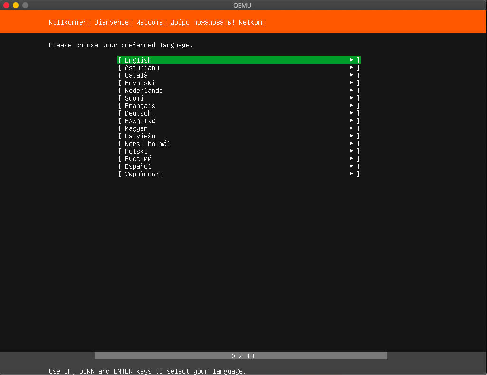

* Keyboard Configuration

  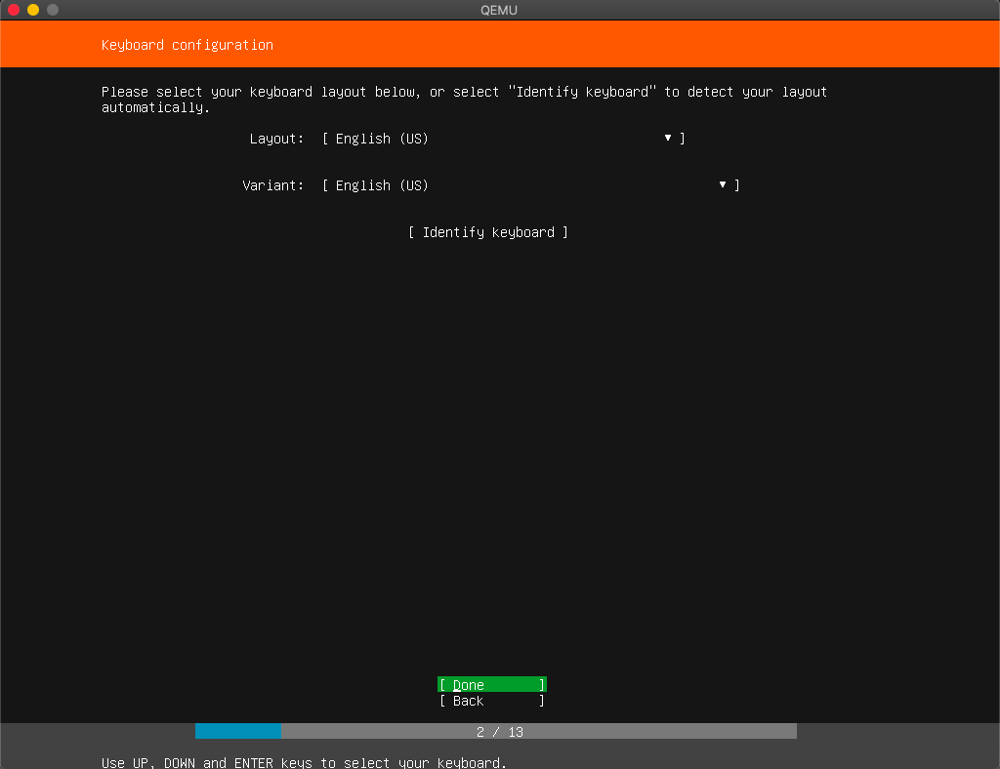

* Network connect

  

* Configure Proxy

  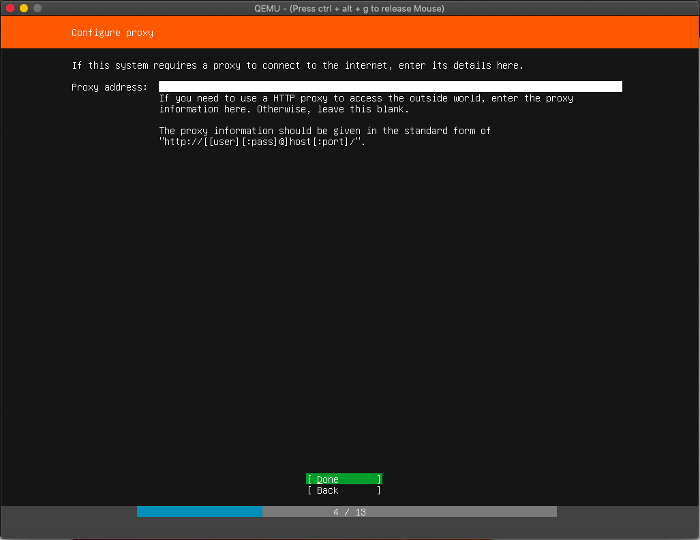

* Configure Ubuntu achive mirror

  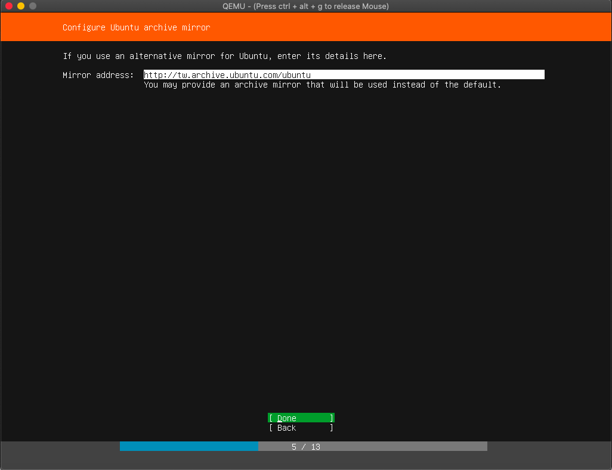

* Filesystem Setup

  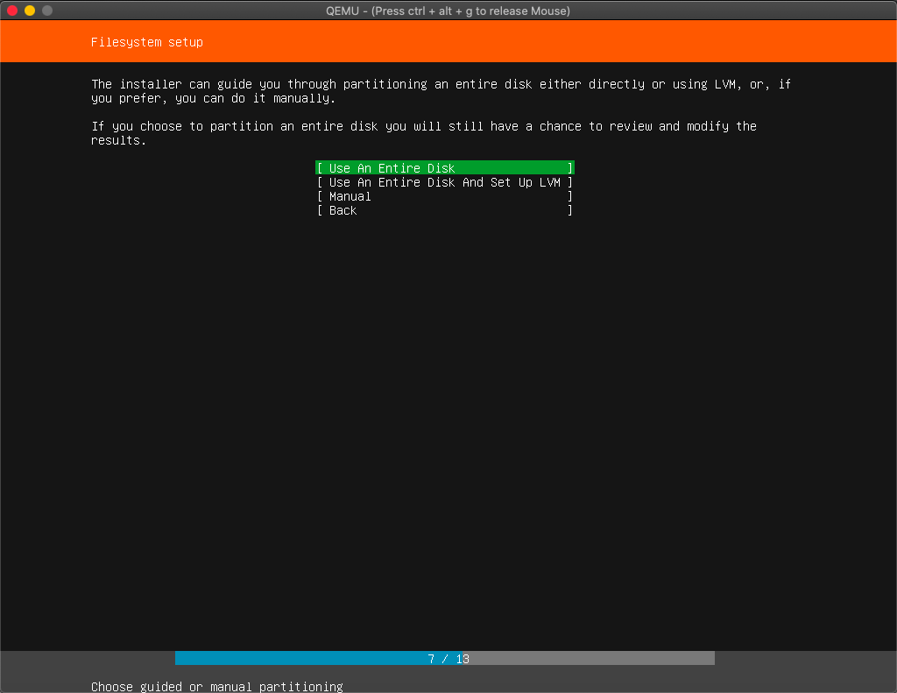

  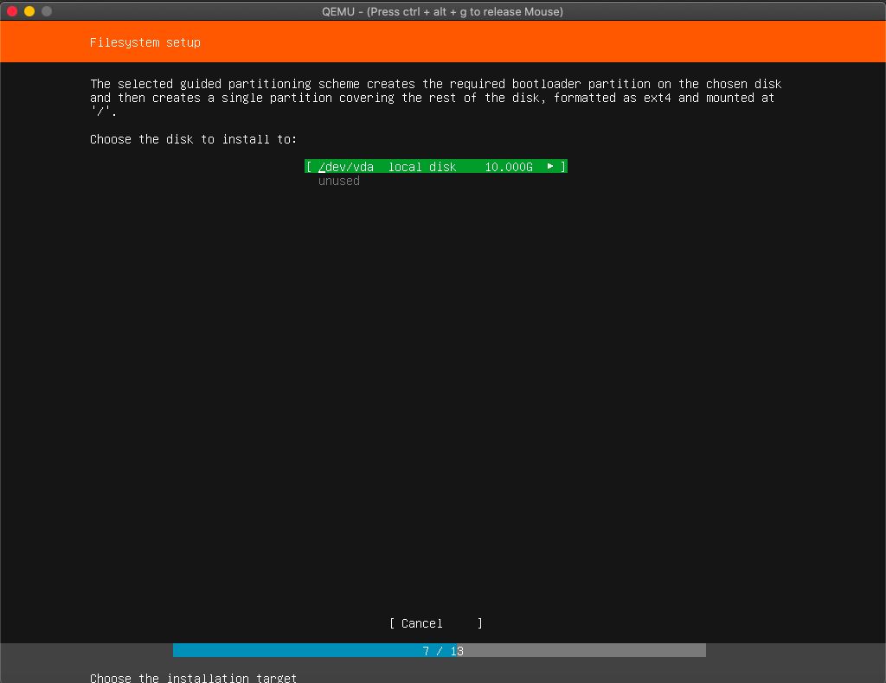

  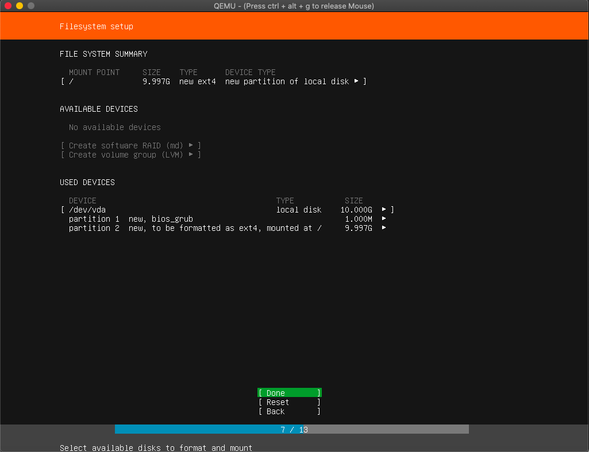

  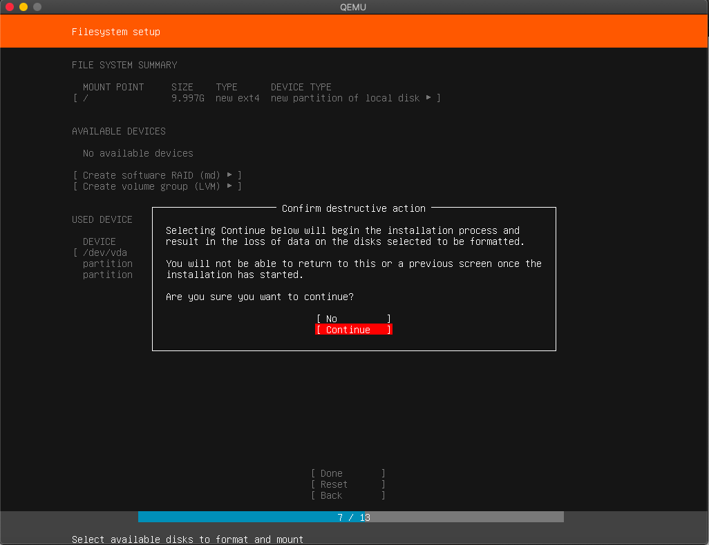

* Profile Setup

  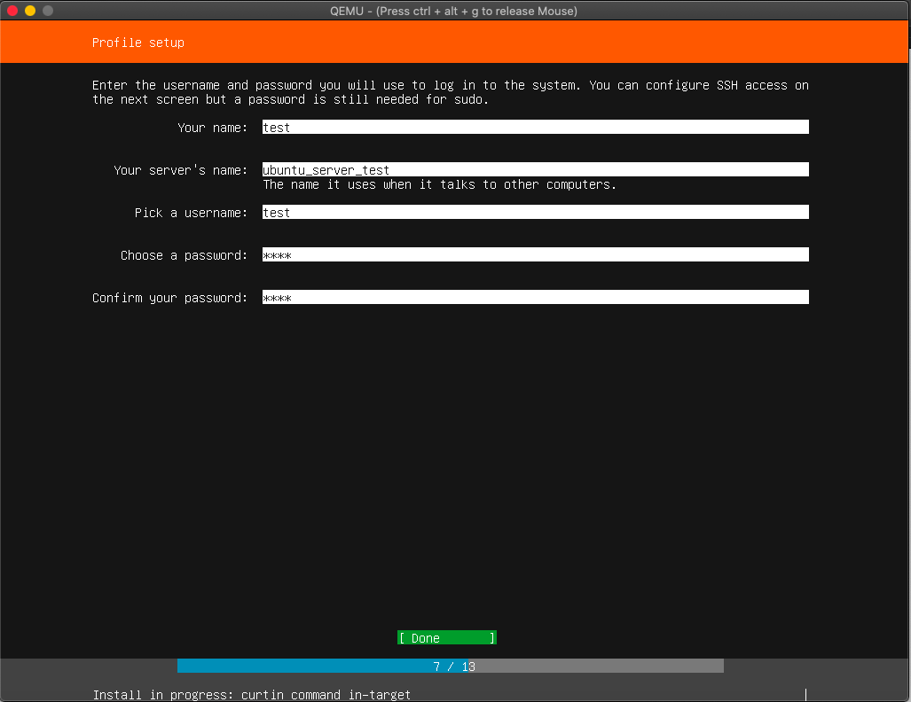

* SSH Setup

  **enable** install OpenSSH Server

  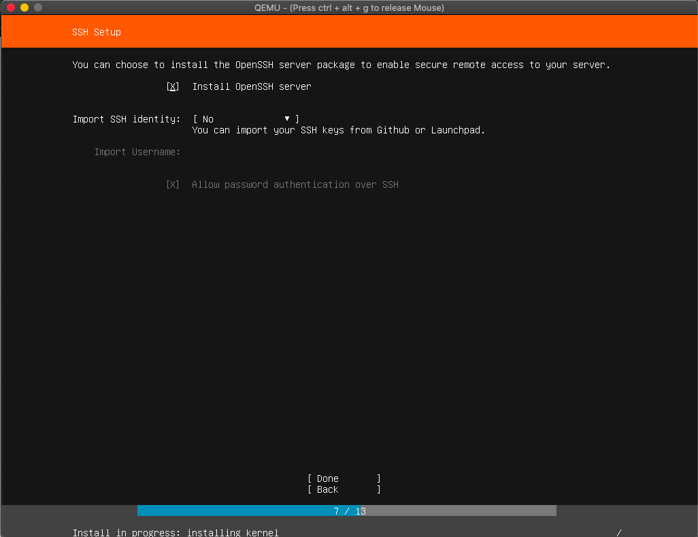

* Featured Server snaps

  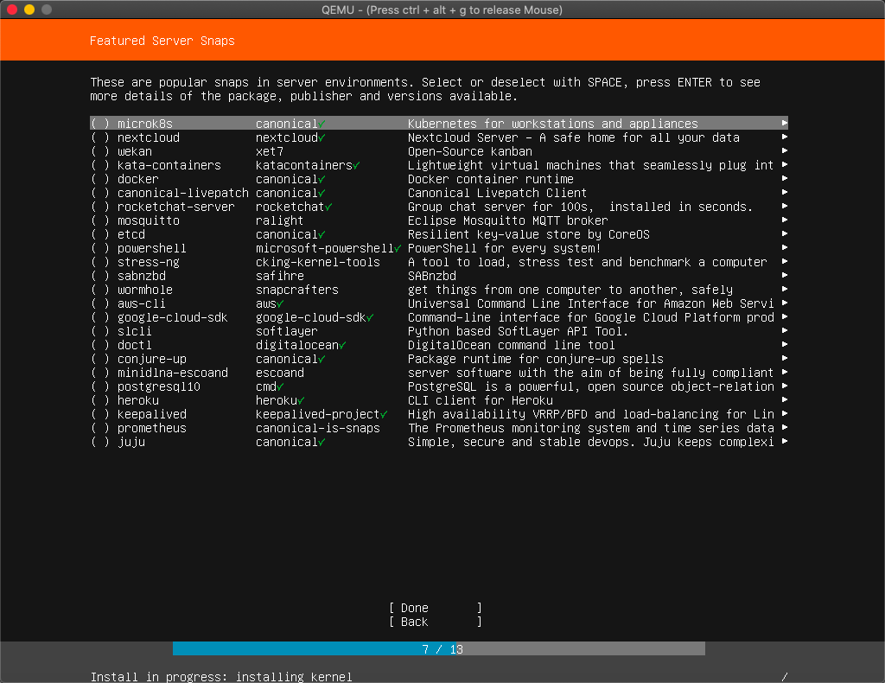

## Reboot without Ubuntu ISO attached

```
echo "qemu-system-x86_64 \
-m 2048 \
-vga virtio \
-show-cursor \
-usb \
-device usb-tablet \
-enable-kvm \
-drive file=~/QEMU/ubuntu-desktop-18.04.qcow2,if=virtio \
-accel hvf \
-cpu host 
```

## Create start VM script

```
echo "qemu-system-x86_64 \
-m 2048 \
-vga virtio \
-show-cursor \
-usb \
-device usb-tablet \
-enable-kvm \
-drive file=~/QEMU/ubuntu-desktop-18.04.qcow2,if=virtio \
-accel hvf \
-cpu host \
-net user,hostfwd=tcp::2222-:22 -net nic" >> ~/QEMU/run.sh && chmod +x ~/QEMU/run.sh
```

Usage

```
./run.sh
```

## Snapshots

Create snapshots

```
qemu-img snapshot -c init ubuntu-desktop-18.04.qcow2
```

Restore (apply) snapshot

```
qemu-img snapshot -a init ubuntu-desktop-18.04.qcow2
```

Delete snapshot

```
qemu-img snapshot -d init ubuntu-desktop-18.04.qcow2
```

List snapshots

```
qemu-img snapshot -l ubuntu-desktop-18.04.qcow2
```


